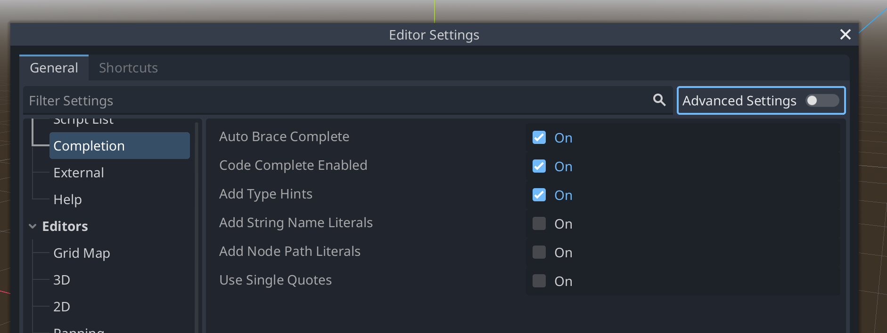
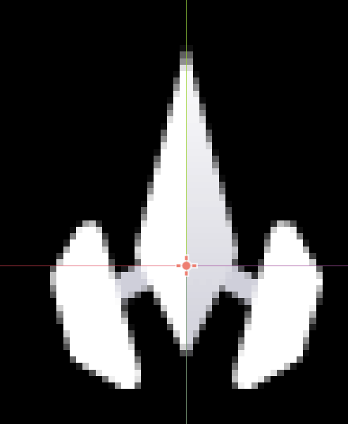

theme: titillium, 1

# [fit] Asteroids

## [fit] Godot 4 - 2D project

---

## Preparation

- Install Godot 4.x
- Setup Project
- Assets

---

## Install

Install Godot 4

---

## Project

Open exercise 1

This is a new project using the compatibility renderer

---

## [fit] Exercise 1

We want to set an editor setting.[^*]

Under Editor Settings:

- Text Editor
- Completion
- Add Type Hints

[^*]: We can only do this with an open project but it sets your local install up for all the following exercises.

---



---

## Project settings

These are the project settings that are changed from the defaults in the exercise files.

---

### Display - Window

- Viewport Width: 1280
- Viewport Height: 720
- Stretch - Mode: viewport
- Stretch - Aspect: keep

---


---

## Project settings

### Rendering

- Default Texture Filter - Nearest
- Default Clear Color - Black

---


---

## Project settings

### Layer Names - 2D Physics

- 1: Player
- 2: Asteroid
- 3: Bullet

---


---

## Provided files

- Sounds were generated using [chiptone](https://sfbgames.itch.io/chiptone)
- [Font from fontspace](https://www.fontspace.com/laser-corps-font-f46094)
- [Artwork from kenney.nl](https://kenney.nl/assets/simple-space)

---

## Tilesheet

The tilesheet is a set of 64x64 pixel images.

We will select the ones we want by using `Region`

- X/Y - top left corner - measured from top left of image
- W/H - size

E.g. Player - x: 64 y:128 w:64 h:64


---

## [fit] So - let's get started

---

## Player Scene

We'll need a Player scene (Area2D)

It will need a sprite child node.

It will also need a collision child node.


---

## Player Sprite

- Add Sprite2D child node
- Set texture to the provided tilesheet
- Enable region
- Set region rect to x: 64, y: 128, w: 64, h: 64

---


---

But - the center (will be used for rotation) is too far forward.

We want it about the widest point of the body.

- Set the sprite transform to y: -10



---

## Player Collision

- Add CollisionPolygon2D child node
- Draw round main body of ship
- On the player node - set collision layer for player to layer 1, no mask


---

## Player Rotation

Let's get it rotating

Add script to the player node

---

```
extends Area2D

@export var rotation_max: = 3

func _process(delta: float) -> void:
	var rotate_input = Input.get_axis("ui_left", "ui_right")

	rotation += rotation_max * rotate_input * delta

	rotation = fmod(rotation, TAU)
```

---

## [fit] Exercise 2

Open exercise 2.

The player scene is set up - but we need to get rotation working.

Complete the player script.

---

## World Scene

It's hard to see the player in the corner.

Let's put it middle of screen.

This means we'll need a world.

- Create world scene (Node2D)
- Add player node as child
- Add script to world

---

```
extends Node2D

@onready var screen_size: Vector2i = get_viewport().size

@onready var player: = $Player

func _ready() -> void:
    # Put player in middle of screen
	player.position = screen_size / 2

```

---

## [fit] Exercise 3

Open exercise 3.

- Create the world scene (new Node2D scene)
- Add the player to it (drag the player scene to the node tree)
- Add script
- Copy in the starter script code from exercise3/exercise_starter.gd
- Complete the script

---

## Player Movement

OK - let's get it to move too

Extend the player script

---

## A little trigonometry


---

```
@export var speed_max: = 200

func _process(delta: float) -> void:
    ...

	var acceleration = Input.get_action_strength("ui_up")

	if acceleration > 0:
		var y = -speed_max * cos(rotation)
		var x = speed_max * sin(rotation)

		position += Vector2(x, y) * delta
```

---

## [fit] Exercise 4

Open exercise 4.

- Complete the player script
- Run the game
- Fly around :)

---

## Wrap around

Hmm

It goes off screen

Let's get wraparound

Extend the player script

---

We could do the math

```
	if position.x > screen_size.x:
		position.x = 0
	if position.y > screen_size.y:
		position.y = 0
	if position.x < 0:
		position.x = screen_size.x
	if position.y < 0:
		position.y = screen_size.y
```

But - we can use `wrapf` to make that simpler

```
@onready var screen_size: Vector2i = get_viewport().size

func _process(delta: float) -> void:
    ...
    screen_wrap()

func screen_wrap() -> void:
	position.x = wrapf(position.x, 0, screen_size.x)
	position.y = wrapf(position.y, 0, screen_size.y)

```

---

## [fit] Exercise 5

Open exercise 5.

Very simple exercise - test out the screen_wrap function.

Do you understand what it is doing?

---

## Shooting - we'll need ammo

We need to be able to shoot stuff.

Add a bullet scene (Area2D)

Add a Sprite2D and CollisionShape2D

---

## Bullet Sprite

- load same texture as before
- enable region
- select region x:448 y:192 w:64 h:64

---

## Bullet collision

Add a circular collision shape

Size it just inside the bullet

On the bullet node - set it on collision layer 3 (bullet) and mask layer 2 (asteroid)


---

## [fit] Exercise 6

Open exercise 6.

Create the bullet scene

[.column]

- Add Area2D Scene - called bullet - save it
- Add Sprite2D and CollisionShape2D nodes
- Load sprite with the same texture

[.column]

- Region: x:448 y:192 w:64 h:64
- Create circle collision shape
- Set collision layer 3 and mask layer 2

---

## Bullet Movement

To make the bullet move - add a script so that we can:

- set the initial rotation
- set the initial direction

Then in process we can make it move and spin:

- count the moved steps
- if moved too far - remove it
- update the position following the set direction
- rotate it a bit

---

```
var direction: = Vector2.ZERO
var moved: = 0
@export var max_move: = 240
@export var speed_max: = 210

func set_direction(radians: float) -> void:
	rotation = radians
	direction = Vector2.UP.rotated(rotation)

func _process(delta: float) -> void:
	moved += 1

	if moved > max_move:
		queue_free()

	position += direction * delta * speed_max

	# Make the bullet spin too
	rotation += 10 * delta
	rotation = fmod(rotation, TAU)

```

---

## [fit] Exercise 7

Open exercise 7.

Complete the bullet script.

---

## Shoot!

We actually need to be able to shoot it from the player.

To do this - we'll add a point on the player for the bullets to come from.

Then - each time the trigger is pulled - we'll create a new bullet instance and place it there - aligned with the ship.

---

## Add the muzzle tip

- Add child Node2D
- Move it with transform - about y: -32 to place at front of ship
- We also want to refer to it in the script - so rename it to Tip

```
@onready var tip: = $Tip
```

---

## Load the bullet

Now - we will need to load the bullet for every shot.

That's not efficient - so - we'll preload the scene so that we can use it multiple times.

```
const bullet = preload("res://Bullet/Bullet.tscn")
```

---

## Detect input and shoot

Then in process - we want to detect the shot - when this happens

- create a new bullet instance
- place it at the tip of the ship
- rotate it to match the ship
- add it to the world scene
- we'll also use the world scene to play the sound[^1]

[^1]: we use the world scene for display and sound so that they continue even if the player dies

---

```
	if Input.is_action_just_pressed("ui_select"):
		var bullet_instance = bullet.instantiate()
		bullet_instance.global_position = tip.global_position
		bullet_instance.set_direction(rotation)
		get_parent().add_child(bullet_instance)
		get_parent().bullet_fired()
```

---

Now - this won't work until we add `bullet_fired` to the world scene.

To do this - in the world node:

- add an AudioStreamPlayer (not 2d or 3d) as a child node
- Call it BulletSoundPlayer
- Add a stream (quick load - choose shoot.wav)

---

Then in the world script:

```
@onready var bulletSound: = $BulletSoundPlayer

func bullet_fired() -> void:
    bulletSound.play()
```

If you want bullets to wrap then you can also add the same wrap function to the bullet script.

I won't but it is possible.

---

## [fit] Exercise 8

Open exercise 8.

- Complete the player script to shoot bullets.
- Complete the world script to play the sound of a shot.

---

## Targets!

We've nothing to shoot at

Let's add an asteroid

---

## Asteroid Scene

- Add an Area2D scene for Asteroid
- Add a Sprite2D
- Add a CollisionShape2D

- Sprite region: x:0 y:256 w:64 h:64
- Collision - circle
- Layers - place on 2 (asteroid) and mask on 1 (player)

---

## Hitting stuff

We need to work on collisions:

- Player can be hit by asteroids
- Asteroid can be hit by bullets

We've already set up the collision layers for this - but we need to actually detect the collisions and do something when they happen.

---

## Dying

The asteroid needs to react if it hits the player.

Select the asteroid node then in the node menu - connect the "area entered" event.

We'll send a signal when this happens that will trigger changes in the world.

Expand the asteroid script

---

```
signal kill

func _on_area_entered(area: Area2D) -> void:
	kill.emit()
```

---

Then set up the World

- Add a new AudioStreamPlayer
- call it KillSoundPlayer
- add the die.wav stream

Expand the world script

---

```
@onready var killSound: = $KillSoundPlayer

const asteroid = preload("res://Asteroid/Asteroid.tscn")

func ready() -> void:
    ...
	var asteroid_instance: = asteroid.instantiate()

	add_child(asteroid_instance)
	asteroid_instance.position = screen_size / 4
	asteroid_instance.kill.connect(kill_player)


func kill_player():
	killSound.play()
	player.queue_free()

```

---

## [fit] Exercise 9

Open exercise 9.

- Complete the asteroid script to emit the kill event.
- Complete the world script to play the sound of the player being hit and to remove the player.

---

## Hitting asteroids

The bullet needs to react if it hits an asteroid.

Select the bulet node then in the node menu - connect the "area entered" event.

This time we'll also have to send which asteroid (area) was hit when we signal.

Expand the bullet script

---

```
signal hit

func _on_area_entered(area: Area2D) -> void:
	hit.emit(area)
```

---

Only the player knows about the bullet - so this needs to pass the event on.

In the player script:

```
func _process(delta: float) -> void:
    ...

	if Input.is_action_just_pressed("ui_select"):
        ...
		bullet_instance.hit.connect(bullet_hit)

func bullet_hit(area: Area2D) -> void:
	get_parent().hit(area)
```

---

Then set up the World

- Add a new AudioStreamPlayer
- call it HitSoundPlayer
- add the boom.wav stream

Expand the world script

---

```
@onready var hitSound: = $HitSoundPlayer

func hit(area):
	hitSound.play()
	area.queue_free()
```

---

## [fit] Exercise 10

Open exercise 10.

- Complete the bullet script to emit the hit event.
- Connect the hit event to bullet_instance in the player script and call the hit method in the world script.
- Complete the world script to play the sound of the asteroid being hit and to remove the asteroid.

---

# [fit] Other stuff to add

## See the longer presentation in the same repository for details

- Asteroid movement
- Asteroids should also wraparound
- Multiple asteroids
- End game
- Restart

---

# [fit] Other possible improvements to look at

- Scoring
- Start/Died/Won screens
- Engine effects (sound, particles)
- Different asteroids
- Asteroid breakup to smaller rocks
- ...
